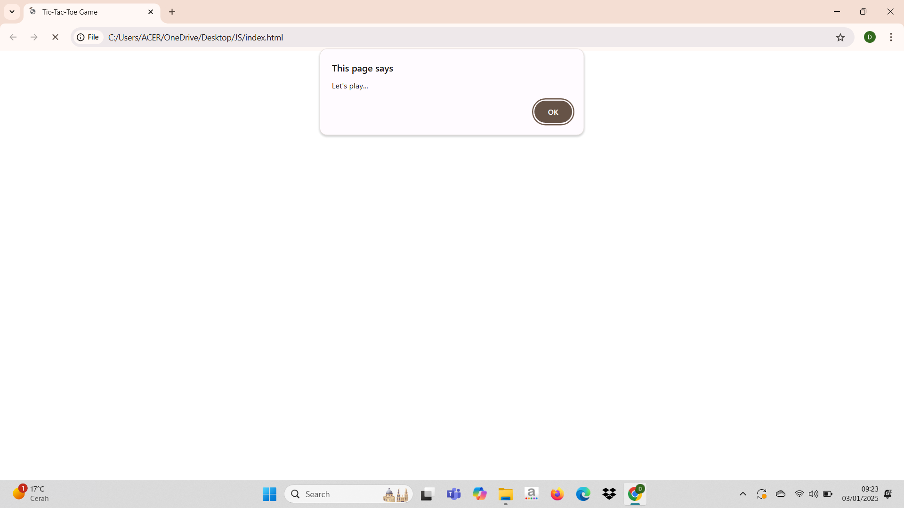
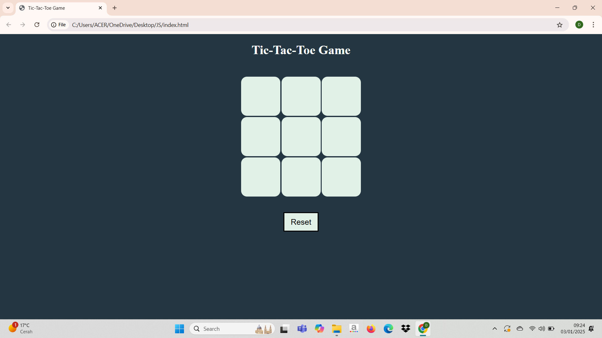
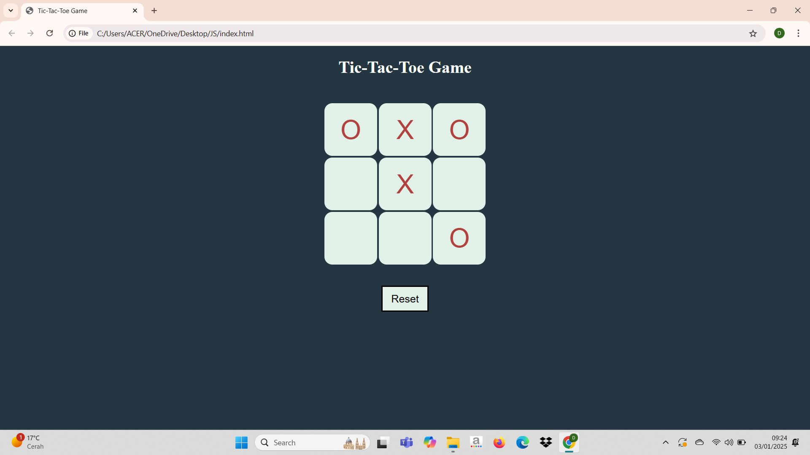
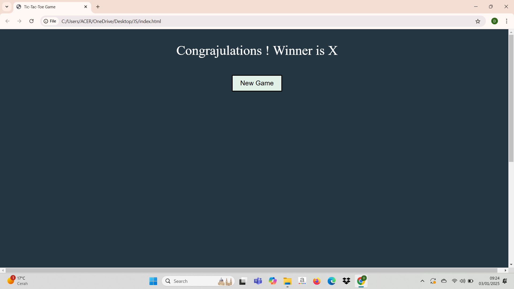

# Tic Tac Toe Game 🎮

Welcome to the Tic Tac Toe game! This project is a simple implementation of the classic game using JavaScript, HTML, and CSS.
This project allows two players to play Tic Tac Toe in the browser.

## Features

- Player vs Player mode  
- Responsive Design for all devices 
- Interactive and dynamic UI  
- Clear winner declaration  

## Technologies Used

- **HTML5** : For the game structure  
- **CSS3** : For styling and animations  
- **JavaScript** : For game logic and interactivity  

## How to Play

Clone the repository :  
https://github.com/Drushti008/Tic-Tac-Toe.git
 
1. Open the index.html file in your browser. 
2. Start playing with your friend! 
     - Player 1 : O 
     - Player 2 : X 

## Screenshots

Here's how the game looks :  
### Let's Play 

### Game Interface

### Result Interface

## Future Enhancements 

- Add single-player mode (player vs. AI)  

- Implement score tracking  

- Add animations and sound effects  

- Enhance UI/UX with better styling 

## Contributing 🤝

Contributions are welcome! If you'd like to contribute, please follow these steps: 

1. Fork the repository. 

2. Create a new branch for your feature or bugfix. 

3. Commit your changes and push them to your fork. 

4. Submit a pull request. 
 

